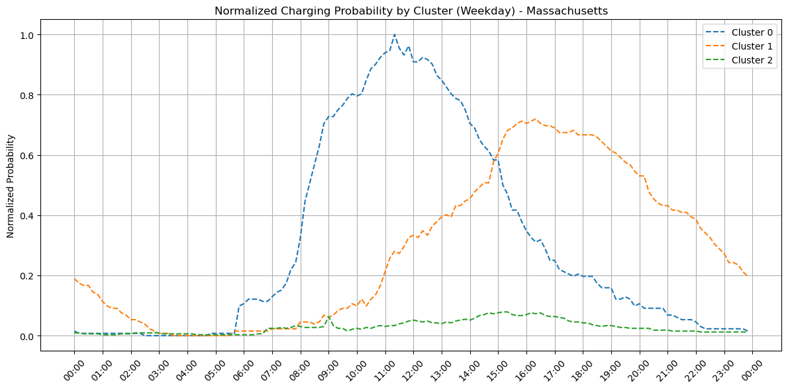
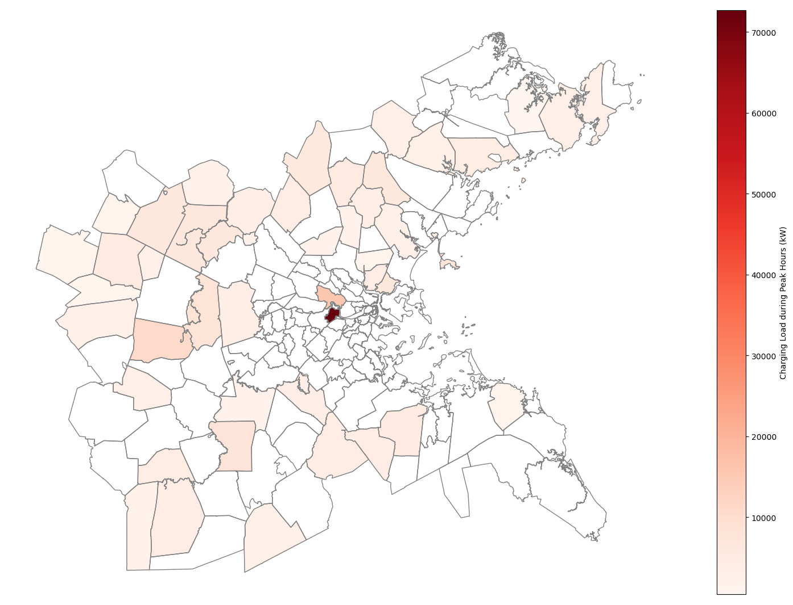
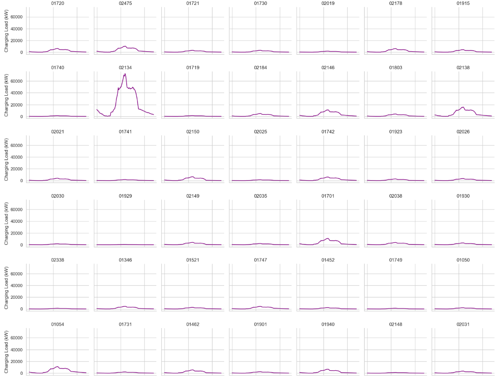

# Data-Driven Estimation of Residential EV Charging Loads: Boston, MA

## Overview
This repository provides realistic residential electric vehicle (EV) charging load data for the Boston, MA. It includes both the original dataset used for generating synthetic data and the resulting synthetic charging load data.

## Features
### Training Dataset
#### Sampled Electric Vecicle Data (`SampledVehicle.xlsx`)
- `vehicle_id`: An anonymized identifier for each vehicle.
- `vehicle_type`: Classification of the vehicle (e.g., Passenger Car, Bus, Multipurpose Vehicle).
- `electrification_level`: Specifies whether the vehicle is a BEV (Battery Electric Vehicle) or PHEV (Plug-in Hybrid Electric Vehicle).
- `state`: Indicates the vehicle's registered state (e.g., Massachusetts).
- **Datasource**: [EVWatts Public Database](https://livewire.energy.gov/ds/evwatts/evwatts.public)

#### Sampled Electric Vehicle Charging Sessions Data (`VehicleChargingSessions.xlsx`)
- `id`: Unique identifier for each charging session.
- `vehicle_id`: Anonymized identifier linking to the vehicle data.
- `start_datetime`: Start time of the charging session, formatted as `MM/DD/YY hh:mm`.
- `stop_datetime`: End time of the charging session, formatted as `MM/DD/YY hh:mm`.
- **Datasource**: [EVWatts Public Database](https://livewire.energy.gov/ds/evwatts/evwatts.public)

#### Boston EV Registration Data (`BostonEVCount.xlsx`)
- Provides detailed EV registration data for Boston, MA.
- `zipcode`: The ZIP code associated with each registration.
- `carname`: The name or model of the registered vehicle.
- `evcount`: The number of EVs registered within each ZIP code.

#### Registered EV's Battery Spec Data (`BatterySizeData.xlsx`)
- Provides detailed battery specs of registrated EV data for Boston, MA.
- `carname`: The name or model of the registered vehicle.
- `batterysize`: Battery capacity of each EV (in kWh).
- **Datasource**: Official manufacturer websites.

### Synthetic Residential EV Charging Load Data (`ChargingProfilesZipcode.xlsx`)
- Synthetic data contains 10-minute interval residential EV charging loads for all ZIP codes in Boston, MA.
- Data Generation:
  - Based on the charging curves derived from the training dataset.
  - Combined with Boston EV registration data and battery specifications for each EV.
- Assumptions:
  - Each household is equipped with a Level 2 home charger rated at 7 kW.

- **Representative Charging Patterns for Boston, Massachusetts (Probability)**  
  

- **Charging Load Distribution during Peak Hours in Massachusetts**
  

- **Daily EV charging Load Curve by ZIP Code (Sample)**
  

- **Daily EV charging Load Curve for Entire Massachusetts**
  

## Support Team
This project is a collaboration of our group members under the supervision of Prof. Le Xie, Gordon McKay Professor of Electrical Engineering at Harvard John A. Paulson School of Engineering and Applied Sciences (SEAS). The support team keeps processing, correcting and updating the data. The team will also conduct further research analysis and share the latest progress in this repository.

## Contact Us
Please contact us if you need further technical support or search for cooperation. Pull requests are welcome. For major changes, please open an issue first to discuss what you would like to change.

Email contact: [Dongjoo Kim](mailto:djkim@tamu.edu), [Le Xie](mailto:xie@seas.harvard.edu)
